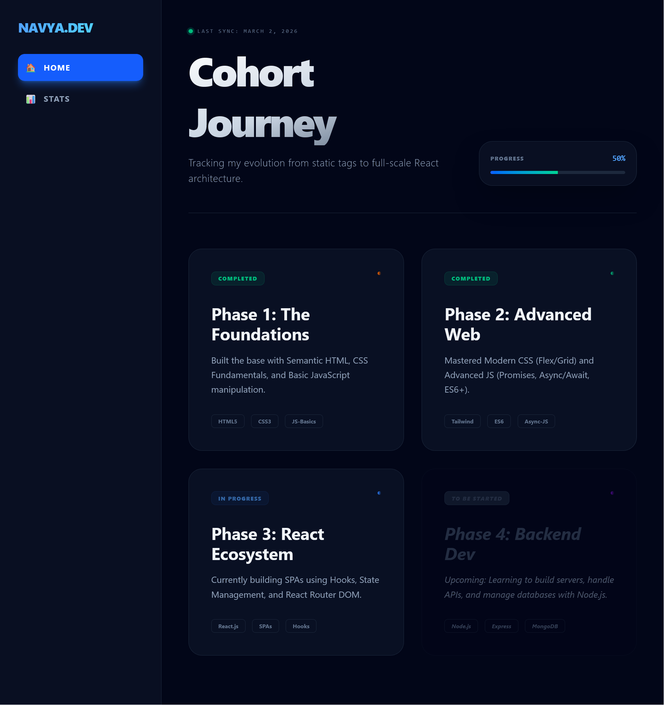
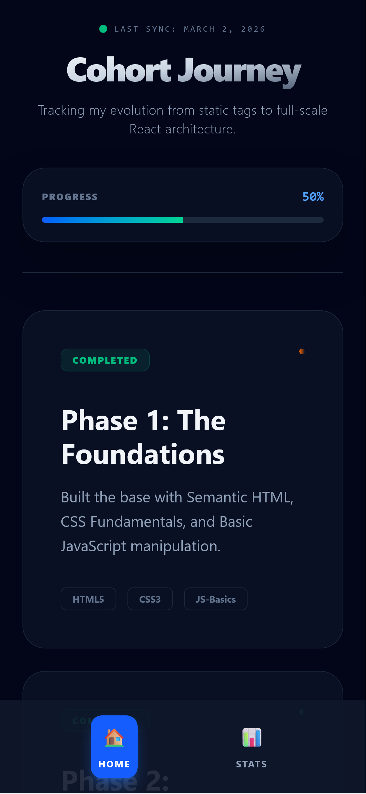

# 🚀 Cohort 2.0: My Learning Journey Dashboard

<p align="center">
  
  
  
  
</p>

---

## 📖 Overview
This is a **Production-Grade Portfolio Dashboard** built during **Cohort 2.0**. It tracks my technical evolution from static HTML/CSS to dynamic React architectures. 

> **🔗 Live Demo:** [Vercel Link](https://dev-portfolio-eta-three.vercel.app/)
> **📂 Status:** Phase 3 (React Ecosystem) - In Progress

---

## 📱 Responsive UI Design

| Desktop View (Sidebar) | Mobile View (Bottom Nav) |
| :---: | :---: |
|  |  |

*Layout adapts from a professional sidebar on large screens to an Instagram-style bottom navigation for mobile users.*

---

## ✨ Key Technical Features
- **Dynamic Progress Logic:** Real-time percentage calculation using React State.
- **Modern Routing:** Implemented `createBrowserRouter` for nested and dynamic (`:id`) routes.
- **Glassmorphism UI:** High-end aesthetic using Tailwind CSS blurs and gradients.
- **Navigation Hooks:** Optimized UX using `useParams` for data fetching and `useNavigate` for history management.

---

## 🗺️ Learning Roadmap
<details>
<summary><b>Phase 1: Foundations (Completed)</b></summary>
- Semantic HTML5 & CSS3 Fundamentals
- Flexbox & CSS Grid Layouts
- Basic JavaScript (DOM Manipulation)
</details>

<details>
<summary><b>Phase 2: Advanced Web (Completed)</b></summary>
- Tailwind CSS Framework
- ES6+ Syntax (Destructuring, Arrow Functions)
- Asynchronous JS (Promises, Async/Await)
</details>

<details>
<summary><b>Phase 3: React Ecosystem (Active)</b></summary>
- Component Lifecycle & Hooks (useState, useEffect)
- **React Router DOM v6.4+**
- State Management & Props Flow
</details>

<details>
<summary><b>Phase 4: Backend Dev (Upcoming)</b></summary>
- Node.js & Express Server Architecture
- REST API Design
- Database Integration (MongoDB)
</details>

---

## 🛠️ Local Installation
1. **Clone the repository:**
   ```bash
   git clone [https://github.com/Navyachhokar/Dev-Portfolio.git](https://github.com/Navyachhokar/Dev-Portfolio.git)
   
2. **Install Dependencies:**
   ```bash
    npm install

3. **Start Development Server:**
   ```bash
    npm run dev

<p align="center">
<b>Built with ❤️ by Navya</b>
</p>